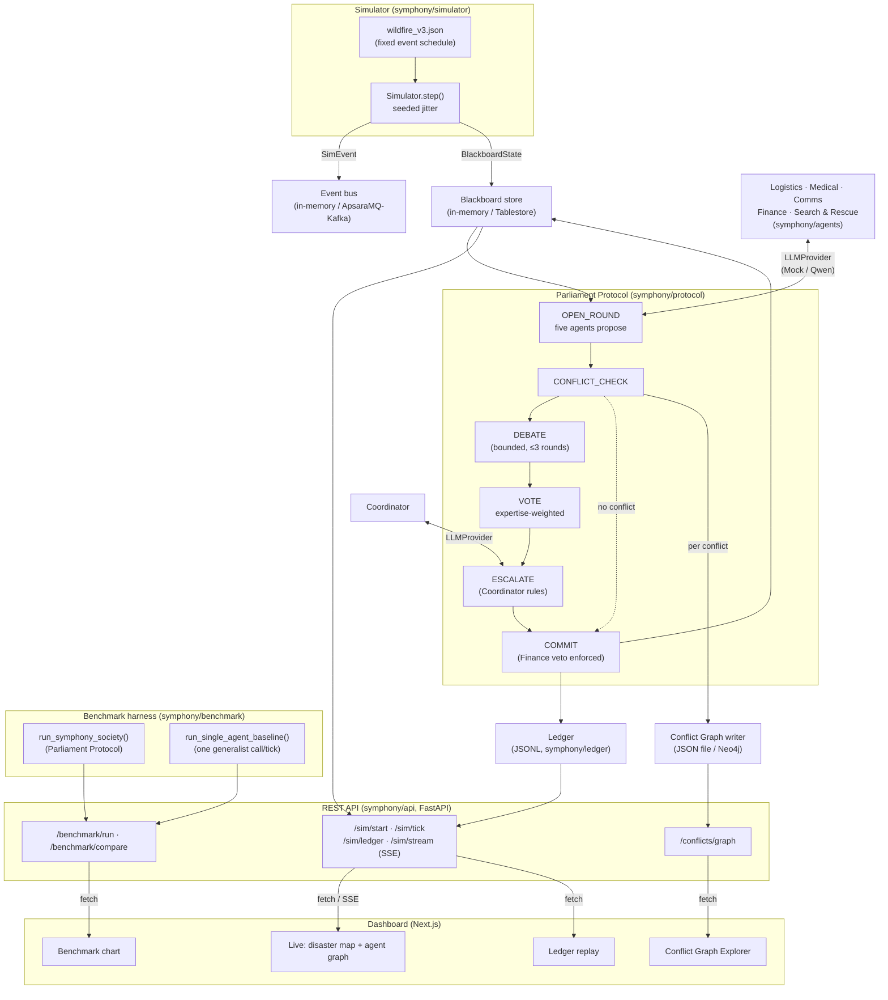
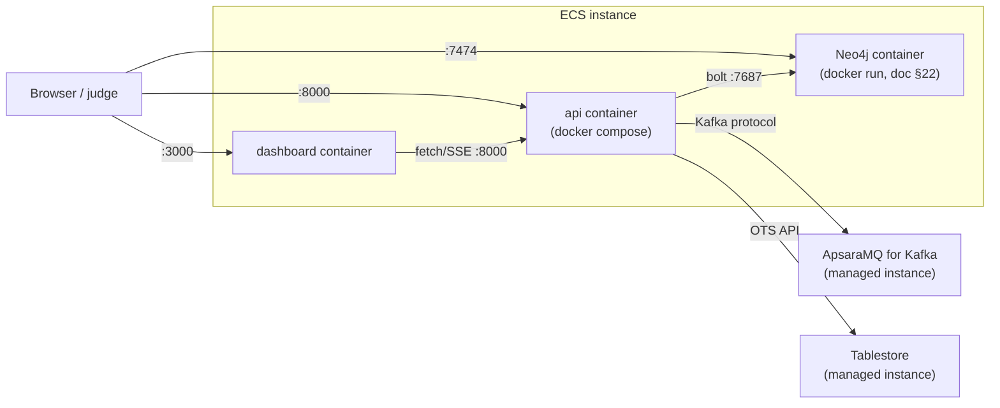

# Architecture

## System overview

## Design principle

> **Agents propose, deterministic code adjudicates.**

Every agent's *proposal* comes from an LLM call (`LLMProvider.complete`). Everything after that —
conflict detection (`_detect_conflicts`), the weighted vote tally (`_run_weighted_vote`), the
Finance veto and its unanimous-override check (`_active_vetoes`), and the commit-to-blackboard
logic (`symphony.protocol.commit`) — is plain, deterministic, unit-tested Python. No LLM call ever
decides who wins a conflict; it only ever produces a proposal, a rebuttal, or a persuasiveness
score that deterministic code then weighs.

## Adapter pattern

Every external dependency sits behind an interface with a zero-config local default and an opt-in
live backend, selected by `symphony/config.py` reading environment variables:

| Concern | Interface | Local default | Live backend |
|---|---|---|---|
| LLM | `LLMProvider` | `MockProvider` (seeded, deterministic) | `QwenProvider` (DashScope) |
| Event bus | `EventBus` | `InMemoryEventBus` | `KafkaEventBus` (ApsaraMQ for Kafka) |
| Blackboard | `BlackboardStore` | `InMemoryBlackboardStore` | `TablestoreBlackboardStore` |
| Conflict graph | `ConflictGraphWriter` | `JsonConflictGraphWriter` | `Neo4jConflictGraphWriter` |

This is why the full test suite (87 tests) and every CLI/API path run with zero API keys and zero
token cost by default — and why the exact same code path runs unmodified against real Alibaba
Cloud services once `SYMPHONY_LLM=qwen` / `SYMPHONY_BUS=kafka` / `SYMPHONY_BLACKBOARD=tablestore` /
`NEO4J_URI=...` are set (see `infra/alibaba-cloud/DEPLOY_RUNBOOK.md`).

## Deployment topology (Alibaba Cloud)

The ECS instance hosts Neo4j directly (per the design doc's exact `docker run` command) and also
runs the `api`/`dashboard` containers via `docker-compose.prod.yml`; Tablestore and ApsaraMQ for
Kafka are separate managed services the API reaches over the network. See
`infra/alibaba-cloud/terraform/` for the resource definitions and
`infra/alibaba-cloud/DEPLOY_RUNBOOK.md` for the full deploy sequence.
